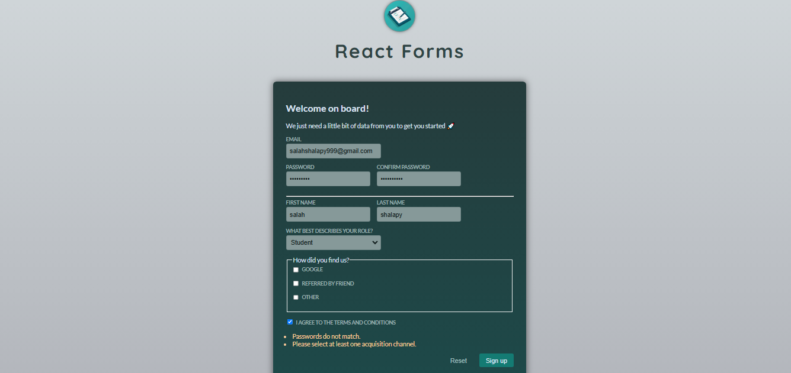

# FormEase (V.2)

[](https://react.dev/)


FormEase (V.2) builds upon the foundation of the original FormEase, introducing a new approach to user input handling by leveraging the form action built-in feature. This version streamlines form processing and state management, making the application more robust and aligned with modern practices.

## Project Overview

### overview



## What’s New in Version 2?

1. Form Action Integration:

- Simplifies form submission and validation logic by embracing the browser's native form capabilities.e.

2. Efficient State Handling:

- Reduces reliance on custom hooks for input tracking, shifting the focus to handling data in the submission flow.

3. Enhanced Maintainability:

- A cleaner and more declarative approach to forms, making the codebase easier to understand and extend

4. Updated Signup Workflow:

- Now utilizes built-in form events to validate inputs and reset fields.

## Example Use Cases

1. Login Form: Validates email format and password length before submission.

2. Signup Form: Ensures passwords match, validates terms acceptance, and processes multi-field inputs like name, role, and acquisition channels.

## Project Structure

```
PlacePicker
│      .gitignore
│      .vite.config
│      index.html
│      package-lock.json
│      package.json
│      README.md
│
│
└───public
│   vite.svg
│   overview.png
│
└───src
    │   App.jsx
    │   main.jsx
    │   index.css
    │
    ├───assets
    │      vite.svg
    │
    ├───components
    │      Header.jsx
    │      Singup.jsx
    │
    ├───util
    │      validation.js
    │
```

## Installation

To get started with the project locally:

1. Clone the repository:
   ```bash
   git clone https://github.com/SalahShallapy/FormEase-V.2-.git
   ```
2. Navigate to the project directory:
   ```bash
   cd FormEase-V.2-
   ```
3. Install dependencies:
   ```bash
   npm install
   ```
4. Run the project:

   ```bash
   npm run dev
   ```

## Contributing

Contributions are what make the open source community such an amazing place to learn, inspire, and create. Any contributions you make are **greatly appreciated**.

If you have a suggestion that would make this better, please fork the repo and create a pull request. You can also simply open an issue with the tag "enhancement".
Don't forget to give the project a star! Thanks!

1.  Fork the Project
2.  Create your Feature Branch (`git checkout -b feature/AmazingFeature`)
3.  Commit your Changes (`git commit -m 'Add some AmazingFeature'`)
4.  Push to the Branch (`git push origin feature/AmazingFeature`)
5.  Open a Pull Request

   <p align="right">(<a href="#top">back to top</a>)</p>
